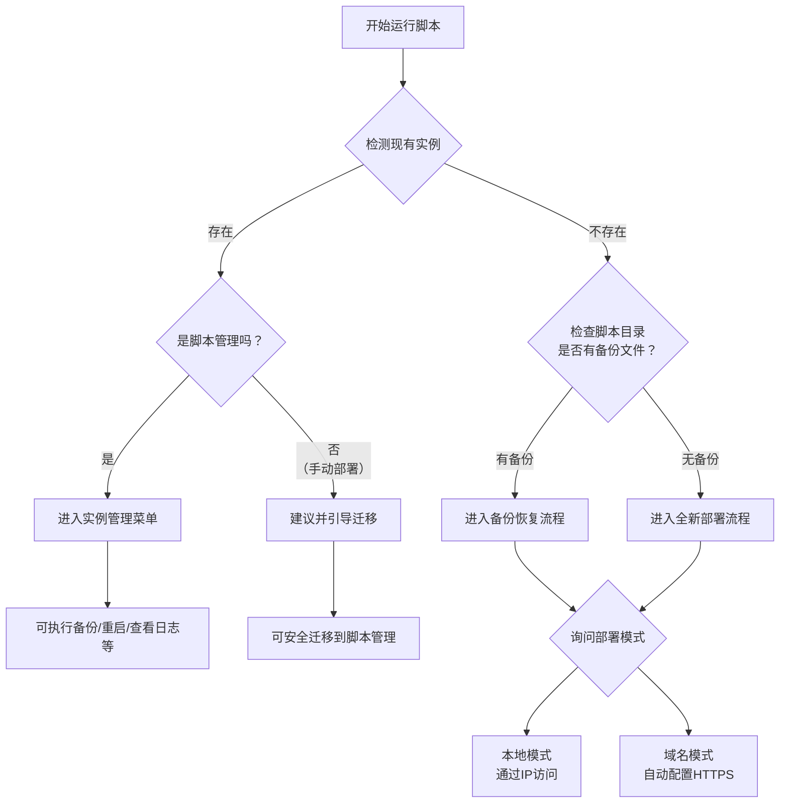

## 📦 茂亨Odoo外贸专用版自动化部署脚本

这是一个用于自动部署和管理 **茂亨Odoo外贸专用版** 的Bash脚本。它简化了在Linux服务器上通过Docker安装和配置Odoo的过程，支持本地和域名两种部署模式，并内置了自动化检测和迁移功能。

---

### ✨ 主要功能

*   **自动化部署**：一键安装Docker、Odoo、PostgreSQL和Nginx，并完成配置优化。
*   **双模式支持**：
    *   **本地模式**：通过服务器IP地址直接访问，无需端口号。
    *   **域名模式**：自动配置域名、Nginx反向代理和Let‘s Encrypt SSL证书（HTTPS）。
*   **智能检测**：
    *   自动检测服务器上是否已存在Odoo实例。
    *   智能区分**脚本管理**的实例或**手动部署**的实例。
*   **平滑迁移**：可将现有的手动部署的Odoo容器，安全地迁移至本脚本的统一管理体系。
*   **管理功能**：提供备份、恢复、日志查看、重启等日常管理命令。
*   **系统优化**：根据服务器CPU和内存资源，自动优化Odoo和PostgreSQL的配置参数。

---

### 🚀 快速开始

1.  **环境要求**：一个干净的Ubuntu/Debian服务器（推荐）。
2.  **获取脚本**：
    ```bash
    wget https://raw.githubusercontent.com/morhon-tech/morhon-odoo/main/odoo-manager.sh
    chmod +x odoo-manager.sh
    ```
3.  **运行脚本**：
    ```bash
    sudo ./odoo-manager.sh
    ```
4.  **跟随引导**：脚本会自动检测环境，并引导你完成部署、迁移或管理操作。

---

### 🔍 脚本运行逻辑

当你第一次运行脚本时，它会执行以下智能检测流程来决定下一步操作：



---

### 📖 详细使用方法

你可以直接运行 `sudo ./odoo-manager.sh` 进入交互式菜单，也可以通过以下命令行参数快速执行特定任务：

| 命令 | 作用说明 |
| :--- | :--- |
| `sudo ./odoo-manager.sh init` | **初始化服务器环境**，安装所有必要的依赖（Docker, Nginx等）。 |
| `sudo ./odoo-manager.sh deploy` | **核心部署命令**，触发自动检测流程，根据当前情况进入部署、迁移或管理菜单。 |
| `sudo ./odoo-manager.sh backup` | **备份实例**（仅对脚本管理的实例有效），将数据库和配置打包。 |
| `sudo ./odoo-manager.sh logs` | 查看Odoo容器日志。 |
| `sudo ./odoo-manager.sh optimize` | 执行系统优化。 |
| `sudo ./odoo-manager.sh monitor` | 查看系统资源监控状态。 |
| `sudo ./odoo-manager.sh help` | 查看脚本帮助信息。 |

**部署路径示例**：
*   **全新服务器**：`init` -> `deploy` -> 进入全新部署流程 -> 根据提示选择域名或本地模式。
*   **已有手动部署**：`deploy` -> 脚本检测到手动实例 -> 选择迁移 -> 按指引完成。
*   **管理现有脚本实例**：`deploy` -> 自动进入管理菜单 -> 进行备份、重启等操作。

---

### ⚙️ 重要配置与目录

脚本使用固定的配置，保证了部署的一致性：

*   **实例目录**：`/opt/morhon-odoo/` (所有配置文件存放于此)
*   **数据卷**：
    *   数据库卷：`odoo-db-data`
    *   文件卷：`odoo-web-data`
*   **镜像**：使用阿里云仓库的特定版本镜像。
*   **Nginx配置**：自动生成，禁止直接访问数据库管理界面以增强安全。

如果你对特定配置（如优化参数、端口等）有修改需求，建议在部署前查阅脚本中的 `generate_docker_compose` 等相关函数。

希望这份说明能帮助你更好地使用和管理这个自动化脚本！如果有关于某个具体功能如何使用的问题，可以随时再问我。
